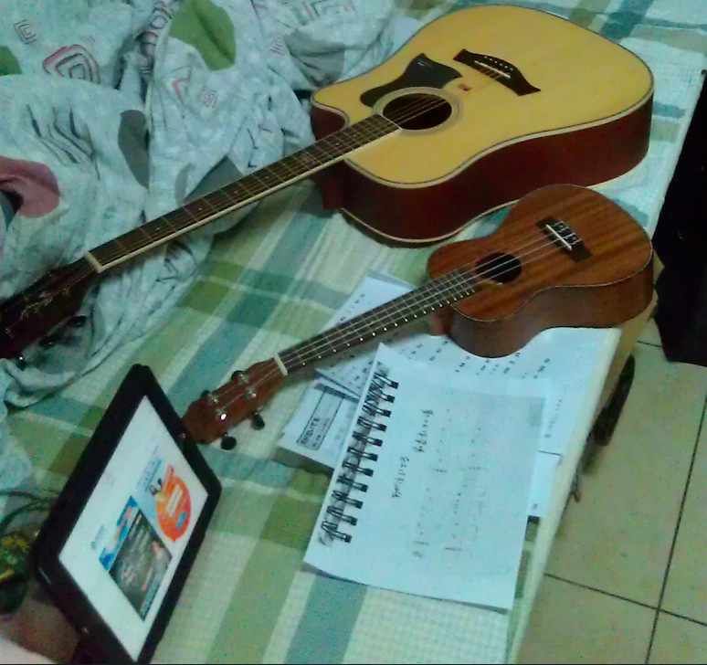
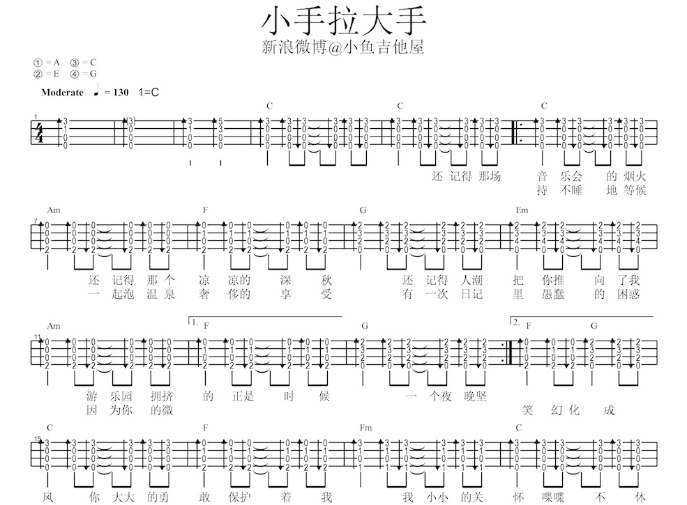
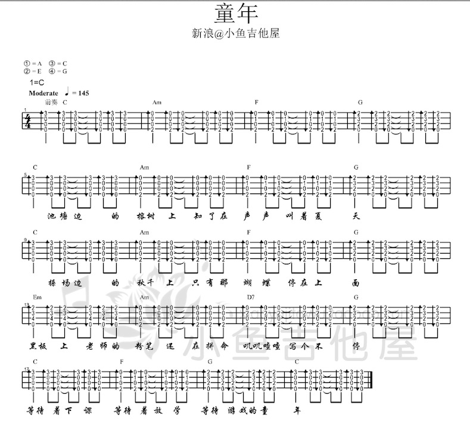
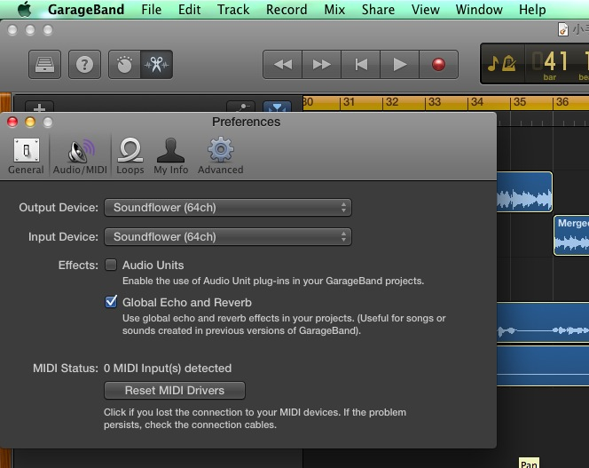
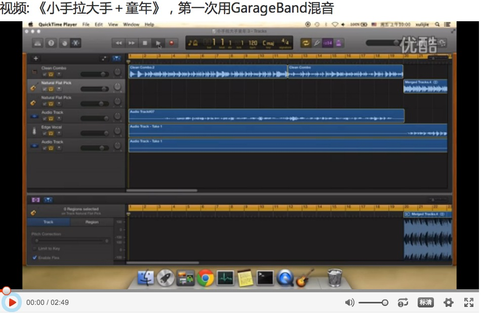

# 第一次使用GarageBand制作音乐
受David Tao影响，最近开始喜欢自己琢磨点音乐了。

跟着[小鱼吉他屋](http://xiaoyujitawu.taobao.com/)学了几个月的Ukulele，里面有很多曲目，包括《小手拉大手》、《童年》、《寂寞的季节》等等。后来，跟着李老师学了几个月吉他，最后一节讲了扫弦，同样练习了《童年》等曲目。由于《小手拉大手》和《童年》的扫弦节奏基本一样，而且有几节的和弦一样，因此可以很自然将两首歌合在一起。制作音乐和自娱自乐地弹唱有很大不同，下面介绍第一次用GarageBand制作的一些经验。

## 准备工作
1. 乐器  
    我这里使用了Ukulele和Guitar。《小手拉大手》的原曲是Ukulele弹奏的，《童年》是吉他弹的。我这里只有16小节使用了吉他。
    
2. 软件：GarageBand  
    Mac OS X版本或者iOS版本都可以，这两个版本都是免费的，更新到最新版本就可以了，iOS版的有一些高级功能比如Smart piano（按一个和弦，可以自动演奏）是要收费的。
3. 耳机话筒：越专业的越好，我这里只用了iPhone的耳机录人声。

## 不是编曲的编曲
1. 选定曲谱  
    找来《小手拉大手》和《童年》的曲谱，[戳这里](http://bangpai.taobao.com/group/thread/15632612-285934659.htm?spm=a1z10.1.w5003-5378408723.6.ADwwzj&scene=taobao_shop)，分析发现《童年》放在《小手拉大手》之前不合适，找不到衔接点。再分析发现《小手拉大手》唱道`幻化成风`的时候，正好一段结束，是C和弦，而童年的开始也是C和弦，可以直接衔接。当然《小手拉大手》后面的副歌很好听，这里为了违和，副歌只能放到下次再录了。
        
        
2. 直接拼接就好了，不需要再改节奏和和弦。

## 录伴奏
1. 设置章节  
    《小手拉大手》前奏4个小节，第一段从`还记得那场`到`一个夜晚坚持`一共9个小节，下一段从`持不睡地等候`到`幻化成风`一共8个小节。《童年》每段16小节。
2. 设置速度  
	谱子里《小手拉大手》的速度是130，《童年》是145，都有点快，我这里都设为120。GarageBand默认是110。
3. 设置节拍器  
	GarageBand默认节拍器是木鱼，可以关闭节拍器或者选择节拍器的音色。比较坑爹的是如果选好节拍器，录好后，是不能去掉节拍器的声音的。因此最好提前选定自己喜欢的节拍器音色。
4. 弹奏  
	一次添加几个小节，然后弹奏录音，然后再添加几个小节，然后再弹奏录音。如果很熟练，也可以一下弹完。弹奏的要点是要跟节拍，不快不慢，第一次好难跟上的说，没办法多录几次吧。多分几个小节的好处是可以再不同小节用不同的乐器，而且重复录的效率高一些。由于童年每段弹奏都一样，可以录好16个小节后，copy一下，就有了32个小节。
5. 章节排列  
	录好后，用GarageBand排列一下每个小节的先后顺序。然后可以听听效果，GarageBand可以选择每个音轨的乐器效果。伴奏录好后，可以录Vocal了。
	
## 录Vocal
1. 找来噪音比较小的话筒
2. 新开一个音轨，设为Audio track，然后开始录音。
3. 注意事项就是唱的要跟上节拍，音要准，不要跑调。我这里后面几个小节基本都在跑调，没办法，没太多时间录音，音色也难听，就这样吧。第一次总是有很多地方不尽人意。😊

## 最后调整
1. 调节每个音轨的音量大小
2. 调节每个音轨的音色效果。
3. 不满意的小节重新录，直到满意。

## 经验
1. GarageBand的iOS版有些地方很好用  
	比如添加章节，重复拷贝小节，重复录音。
2. GarageBand的iOS版有些地方很不好用  
	比如保存多版本不方便，章节排列需要手指拖动，很容易误操作而且容易拉长或缩短章节。后来不能忍了，就把iPad上面录的伴奏导入到OS X版本里了。OS X版本除了没有Smart乐器，其他都挺好的。
3. GarageBand的音效选择没有回退  
	一旦改变了一个音轨的乐器音色并且保存后，很难再回退回去了，只能去手工找相近的乐器音色。
4. 定点录音  
	每次录Vocal的时候，都是新开一个音轨，从头开始录，等到要唱的时候对着话筒唱，不知道是没有从给定位置录音的功能，还是我还没找到。
5. 多保存  
	录好一段满意的就随手保存一下，以防编辑时候的误操作。

## 屏幕录像
OS X自带的QuickTime就可以屏幕录像，只是不能录System audio（就是扬声器或耳机发出的声音），尝试了很久发现了[解决方法](http://apple.stackexchange.com/questions/45689/can-i-get-system-sound-along-with-quicktime-player-screen-recording)，到[这里](http://cycling74.com/products/soundflower/)下载sound flower，然后GarageBand可以自动将Audio的输入输出设置成Soundflower(64)。

然后打开QuickTime，选择屏幕录像，设置Microphone为Soundflower(64)，就可以屏幕录像＋录系统声音了。唯一不爽的是，录的时候自己听不到声音，因为声音送到了Soundflower没有送到扬声器。

## 最终效果

戳 [http://v.youku.com/v_show/id_XNzMyMzQ3OTM2.html](http://v.youku.com/v_show/id_XNzMyMzQ3OTM2.html)